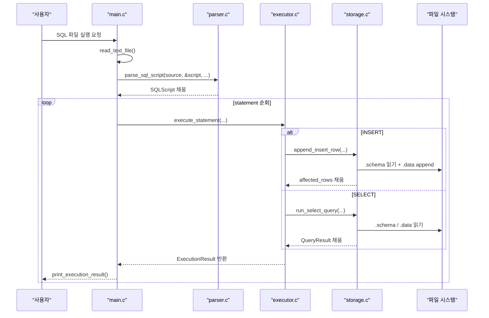
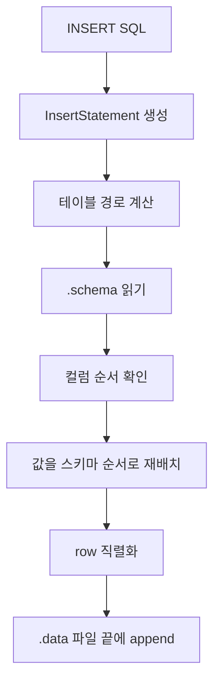
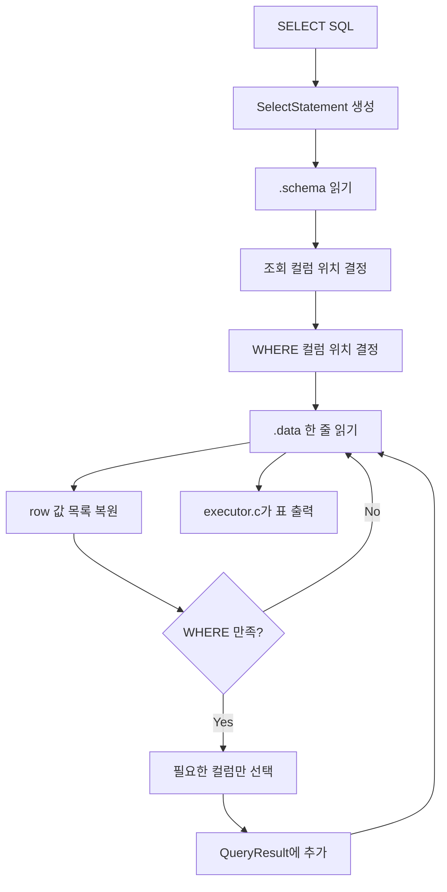

# wk06-mini-sql

간단한 파일 기반 mini SQL 실행기입니다. SQL 스크립트 파일을 읽어 `INSERT`와 `SELECT`를 수행하고, 결과를 `.schema`와 `.data` 파일에 저장합니다.

## 지원 기능

- `INSERT INTO [schema.]table (col1, col2, ...) VALUES (...)`
- `SELECT * FROM [schema.]table`
- `SELECT col1, col2 FROM [schema.]table`
- `WHERE column = value`
- SQL 주석
  - `-- line comment`
  - `/* block comment */`

예시:

```sql
INSERT INTO demo.students (id, name, major, grade) VALUES (2, 'Bob', 'AI', 'B');
SELECT * FROM demo.students;
SELECT name, grade FROM demo.students WHERE id = 2;
```

## 1. 파이프라인



전체 흐름은 `main.c`가 입력 파일을 읽고, `parser.c`가 SQL을 구조체로 파싱한 뒤, `executor.c`와 `storage.c`가 실제 동작을 수행하는 구조입니다.

## 2. INSERT / SELECT 로직

파일 기반 DB이기 때문에 핵심은 항상 `.schema`를 기준으로 컬럼 순서를 해석하고, `.data`를 한 줄씩 row로 다루는 것입니다.

### INSERT



INSERT 단계:

- SQL 파싱: `INSERT INTO ... VALUES ...` -> `InsertStatement`
- 대상 경로 계산: `.schema`, `.data`
- 스키마 로드: 실제 컬럼 순서 복원
- 컬럼 매핑: 입력 컬럼명 <-> 스키마 컬럼
- 값 재배치: 스키마 순서 기준 정렬
- row 직렬화: `serialize_row()`
- 파일 반영: `append_text_file()`로 `.data` append

관련 코드 포인트:

- `append_insert_row()` in `src/storage.c`
- `serialize_row()` in `src/storage.c`
- `find_column_index()` in `src/storage.c`

### SELECT



SELECT 단계:

- SQL 파싱: `SELECT ... FROM ... WHERE ...` -> `SelectStatement`
- 스키마 로드: 전체 컬럼 목록 확보
- projection 준비: 조회 대상 컬럼 위치 결정
- WHERE 준비: 비교할 컬럼 위치 결정
- row 복원: `.data` 한 줄 -> `split_pipe_line()`
- 조건 필터링: WHERE 통과 row만 선택
- projection 적용: 필요한 컬럼만 `QueryResult`에 누적
- 결과 출력: `executor.c`가 표 형태로 출력

관련 코드 포인트:

- `run_select_query()` in `src/storage.c`
- `split_pipe_line()` in `src/storage.c`
- `print_execution_result()` in `src/executor.c`

## 3. 파일 입출력

### 파일 구성

- `.schema`
  - 컬럼 메타데이터 저장
  - 컬럼 순서 보존
- `.data`
  - 실제 row 데이터 저장
  - 한 줄 = 한 row

### 디렉터리 예시

```text
db_root/
  demo/
    students.schema
    students.data
```

### `.schema`

컬럼명 목록을 `|` 구분 텍스트로 저장합니다.

```text
id|name|major|grade
```

### `.data`

실제 row를 `|` 구분 텍스트로 저장합니다.

```text
1|Alice|Database|A
2|Bob|AI|B
3|Choi|Data|A
```

### 주요 함수

#### `src/common.c`

- `read_text_file()`
  - 텍스트 파일 전체 읽기
- `write_text_file()`
  - 파일 새로 쓰기
- `append_text_file()`
  - `.data` 끝에 row 추가
- `ensure_parent_directory()`
  - 상위 디렉터리 생성 보장

#### `src/storage.c`

- `build_table_paths()`
  - `[schema.]table`을 `.schema` / `.data` 경로로 변환
- `load_table_definition()`
  - `.schema`를 읽고 컬럼 순서를 복원
- `serialize_row()`
  - INSERT row를 텍스트 한 줄로 변환
- `split_pipe_line()`
  - `.data` 한 줄을 다시 컬럼 값 목록으로 복원
- `append_insert_row()`
  - INSERT 결과를 `.data`에 기록
- `run_select_query()`
  - `.schema` / `.data` 기반 SELECT 수행

## 4. 시연 / 데모


### 시연 SQL

`examples/sql/demo_workflow.sql`

```sql
INSERT INTO demo.students (id, name, major, grade) VALUES (2, 'Bob', 'AI', 'B');
INSERT INTO demo.students (id, name, major, grade) VALUES (3, 'Choi', 'Data', 'A');
SELECT * FROM demo.students;
SELECT name, grade FROM demo.students WHERE id = 2;
```

### 권장 시연 순서

1. 데모 DB를 초기 상태로 복사합니다.
2. insert 전 `students.data` 한 줄 상태를 보여줍니다.
3. SQL 파일을 실행합니다.
4. `SELECT *`와 `WHERE` 결과를 보여줍니다.
5. insert 후 `students.data`가 3줄이 된 것을 보여줍니다.

### VS Code 터미널 명령어

```powershell
Remove-Item .\tests\tmp\demo_db -Recurse -Force -ErrorAction SilentlyContinue
New-Item -ItemType Directory -Force .\tests\tmp\demo_db | Out-Null
Copy-Item .\examples\db\* .\tests\tmp\demo_db -Recurse -Force
docker run --rm -v "${PWD}\tests\tmp\demo_db:/app/demo_db" -v "${PWD}\examples\sql:/app/sql" mini-sql-demo /app/demo_db /app/sql/demo_workflow.sql
Get-Content .\tests\tmp\demo_db\demo\students.data
```

### 확인 포인트

- insert 전에는 `students.data`가 1줄인지
- SQL 실행 후 `INSERT 1`이 2번 출력되는지
- `SELECT *` 결과가 3 rows인지
- `WHERE id = 2` 결과가 Bob 한 줄만 나오는지
- 실행 후 `students.data`가 3줄인지

## 5. 회고

이번 구현에서 특히 흥미로웠던 점은, 많은 함수가 "실제 결과값 자체"를 반환하지 않고 "성공했는지 실패했는지"만 `bool`로 반환한다는 점이었습니다. 대신 실제 결과 데이터는 포인터나 주소를 통해 직접 채워 넣습니다.

예를 들어 아래 코드는 `parse_sql_script()`가 `SQLScript`를 반환하는 것이 아니라, `&script`로 넘겨준 주소에 파싱 결과를 채우고, 함수 자체는 성공 여부만 돌려줍니다.

```c
if (!parse_sql_script(source, &script, error, sizeof(error))) {
    fprintf(stderr, "parse error: %s\n", error);
    free(source);
    return 1;
}
```

이 방식이 보이는 이유는 다음과 같습니다.

1. C에서는 큰 구조체를 함수 반환값으로 직접 주고받기보다, 호출자가 미리 만든 공간에 값을 채워 넣는 방식이 흔합니다.
2. 성공/실패와 실제 결과 데이터를 분리하면 에러 처리 흐름이 명확해집니다.
3. 같은 패턴을 parser, executor, storage 전반에 통일해서 적용할 수 있습니다.

이 프로젝트에서도 같은 흐름이 반복됩니다.

- `parse_sql_script(source, &script, ...)`
  - 파싱 결과를 `script`에 채움
- `execute_statement(..., &result, ...)`
  - 실행 결과를 `result`에 채움
- `append_insert_row(..., &result->affected_rows, ...)`
  - 영향받은 row 수를 주소로 전달받아 채움
- `run_select_query(..., &result->query_result, ...)`
  - SELECT 결과 테이블을 주소로 전달받아 채움

관련 코드 예시:

```c
if (!execute_statement(&script.items[index], db_root, &result, error, sizeof(error))) {
    fprintf(stderr, "execution error: %s\n", error);
    free_execution_result(&result);
    free_script(&script);
    free(source);
    return 1;
}
```

```c
if (statement->type == STATEMENT_INSERT) {
    result->kind = EXECUTION_INSERT;
    return append_insert_row(db_root, &statement->as.insert, &result->affected_rows, error, error_size);
}

if (statement->type == STATEMENT_SELECT) {
    result->kind = EXECUTION_SELECT;
    return run_select_query(db_root, &statement->as.select, &result->query_result, error, error_size);
}
```

이 패턴을 보면서, C에서는 "무엇을 반환할지"보다 "어디에 결과를 써 넣을지"를 먼저 설계하는 경우가 많다는 점을 체감할 수 있었습니다. 단순히 문법 차이로 끝나는 것이 아니라, 함수 책임 분리와 에러 처리 구조까지 함께 연결된다는 점이 인상적이었습니다.

## 빌드 / 실행 / 테스트

### 빌드

```powershell
.\scripts\build.ps1
```

### 데모 실행

```powershell
.\scripts\demo.ps1
```

또는 직접 실행:

```powershell
.\build\mini_sql.exe examples\db examples\sql\demo_workflow.sql
```

### 테스트

```powershell
.\scripts\test.ps1
```

## 프로젝트 트리

```text
.
+ include/
  - common.h
  - executor.h
  - parser.h
  - storage.h
+ src/
  - common.c
  - executor.c
  - parser.c
  - storage.c
  - main.c
+ tests/
  - test_runner.c
+ scripts/
  - build.ps1
  - demo.ps1
  - test.ps1
+ examples/
  - db/
  - sql/
```
