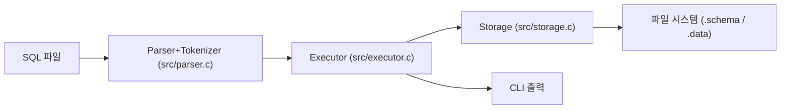
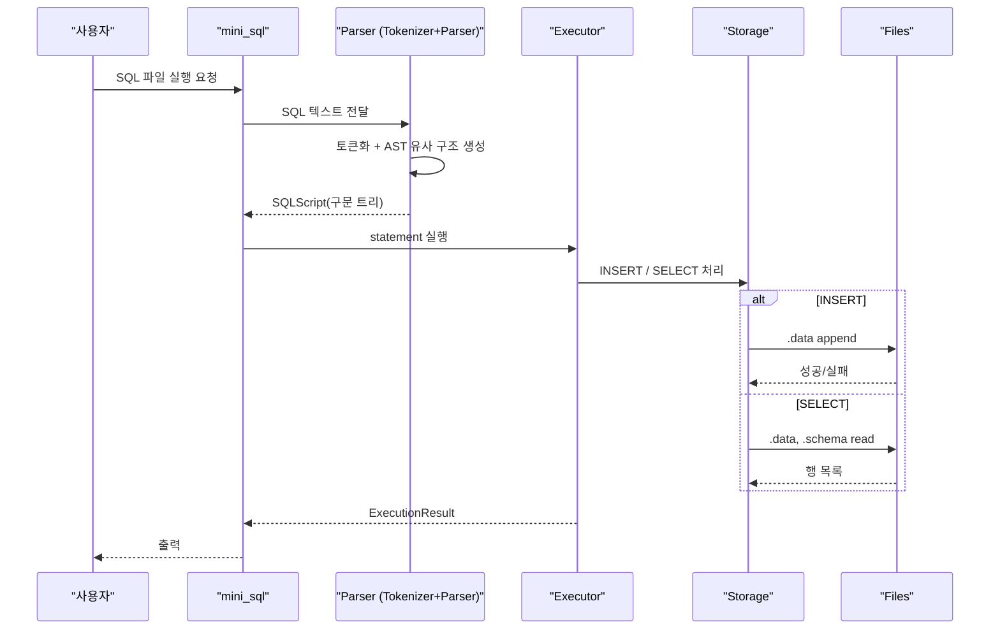
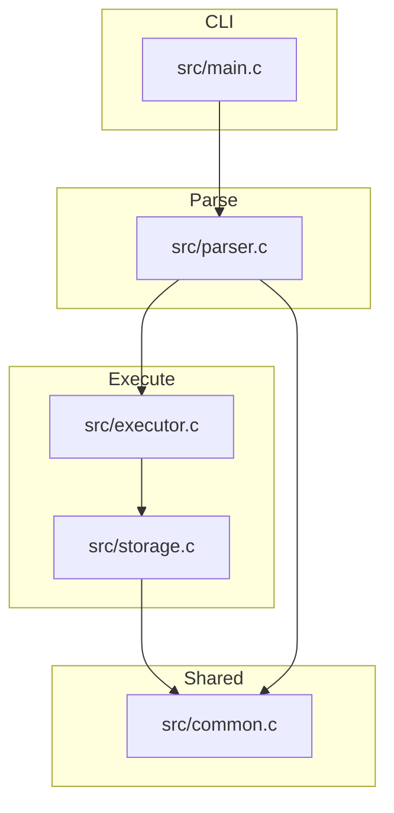

# wk06-mini-sql

간단한 파일 기반 mini SQL 실행기입니다. SQL 스크립트 파일을 읽어 `INSERT`/`SELECT`를 처리하고, 결과를 `.schema`/`.data` 파일로 저장합니다.

## 지원 기능

- `INSERT INTO [schema.]table (col1, col2, ...) VALUES (...)`
- `SELECT * FROM [schema.]table`
- `SELECT col1, col2 FROM [schema.]table`
- `WHERE column = value` (단일 조건만 지원)
- SQL 파일 주석
  - `-- line comment`
  - `/* block comment */`

예시:

```sql
INSERT INTO demo.students (id, name, major) VALUES (1, 'Alice', 'DB');
SELECT * FROM demo.students;
SELECT id, name FROM demo.students WHERE id = 1;
```

---

## 실행 파이프라인


상세 흐름:



---

## 모듈 구조(현재)



핵심 파일:

- `src/main.c`
  - CLI 진입점, 인자 파싱, SQL 파일 로드, 실행 결과 출력.
- `src/parser.c`
  - tokenizer 코드 + 파서 코드 통합.
  - `parse_sql_script()`가 문자열을 토큰화하고 문장 단위 구조(내부 Statement/SQLScript 형태)로 변환.
- `src/executor.c`
  - 파싱된 statement를 실행 타입별로 라우팅.
  - INSERT/SELECT 실행 결과를 `ExecutionResult`로 정리.
- `src/storage.c`
  - `.schema` / `.data` 파일 읽기/쓰기와 조회 로직.
  - 파일 경로 생성, 데이터 검색(기본 WHERE) 처리.
- `src/common.c`
  - 문자열 리스트, 파일 입출력, 경로 유틸(부모 디렉터리 생성) 등 공통 유틸리티.


---

## 파일 기반 DB 레이아웃

예시 DB 루트:

```text
db_root/
  demo/
    students.schema
    students.data
```

`schema`만 바로 쓰는 경우:

```text
db_root/
  students.schema
  students.data
```

### `.schema`
컬럼은 `|` 구분 텍스트

```text
id|name|major|grade
```

### `.data`
한 줄이 한 row이며, `|` 구분 텍스트.

```text
1|Alice|Database|A
2|Bob|AI|B
```

escape 규칙:

- `|` → `\|`
- `\` → `\\`
- 개행(`\n`) / 캐리지(`\r`)을 문자열에 저장할 때 이스케이프

---

## INSERT 처리 흐름

1. 대상 테이블의 `.schema` 로드
2. INSERT 절의 컬럼 목록과 값 목록 매핑 검사
3. 누락/초과 컬럼 오류 검사
4. 값 순서를 스키마 순으로 맞춤
5. `.data` 파일에 한 줄 append

---

## SELECT 처리 흐름

1. `.schema` 로드로 컬럼 인덱스 준비
2. `*` 또는 지정 컬럼 기준으로 projection 구성
3. `.data` 전체 행을 순회하며 `WHERE` 조건 필터
4. 결과 rows를 `QueryResult`로 누적해 출력

---

## 빌드/실행/테스트

### 빌드

```powershell
.\scripts\build.ps1
```

출력:
- `build\mini_sql.exe`
- `build\test_runner.exe`

### 실행(데모)

```powershell
.\scripts\demo.ps1
```

직접 실행:

```powershell
.\build\mini_sql.exe examples\db examples\sql\demo_workflow.sql
```

또는

```powershell
.\build\mini_sql.exe --db examples\db --file examples\sql\demo_workflow.sql
```

### 테스트

```powershell
.\scripts\test.ps1
```

실행 대상:
- `tests\test_runner.c` 정적 테스트
- `scripts\test.ps1` 통합 테스트

---

## 프로젝트 트리

```text
.
+ include/
  - common.h
  - executor.h
  - parser.h    
  - storage.h
+ src/
  - common.c
  - executor.c
  - parser.c
  - storage.c
  - main.c
+ tests/
  - test_runner.c
+ scripts/
  - build.ps1
  - demo.ps1
  - test.ps1
+ examples/
  - db/
  - sql/
```

---
