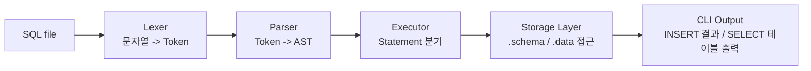
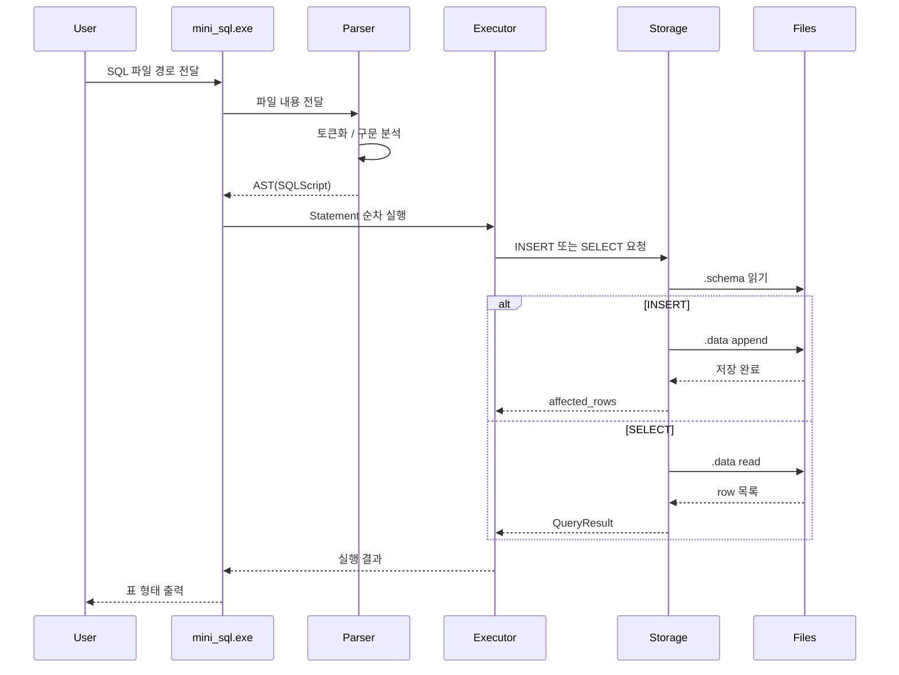
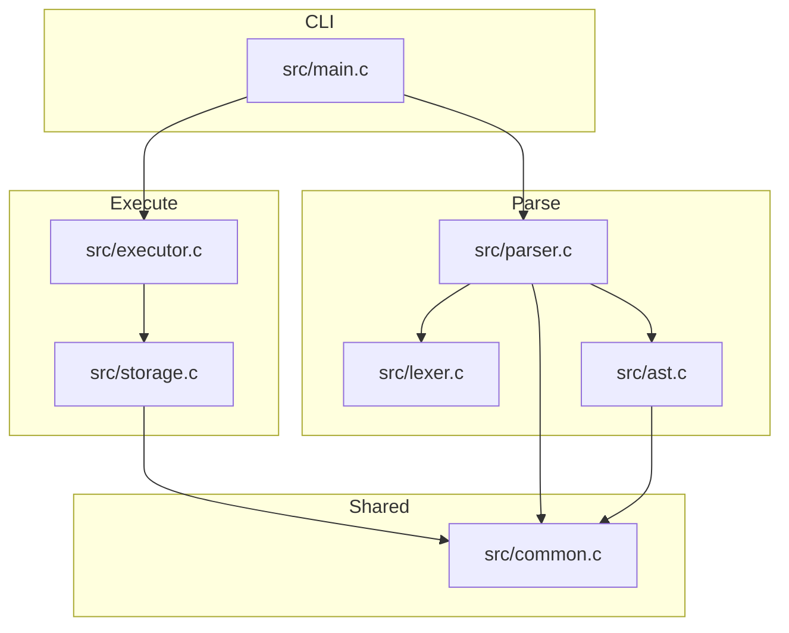

# wk06-mini-sql

C로 구현한 파일 기반 미니 SQL 처리기입니다.  
SQL 파일을 CLI로 받아 `파싱 -> 실행 -> 파일 저장/조회` 흐름으로 처리하며, 과제 요구사항인 `INSERT`, `SELECT`, 파일 기반 DB, 단위 테스트/기능 테스트를 포함합니다.

## 1. 프로젝트 목표

이 프로젝트는 "DBMS의 핵심 흐름을 직접 구현해 보는 것"에 초점을 맞췄습니다.

- 입력은 SQL 텍스트 파일입니다.
- SQL을 토큰화하고 AST로 파싱합니다.
- `INSERT`는 파일에 row를 추가합니다.
- `SELECT`는 파일에서 row를 읽고 결과를 테이블 형태로 출력합니다.
- `CREATE TABLE`은 요구사항에 따라 제외했습니다.
- 대신 `schema/table`이 이미 존재한다고 가정하고 `.schema` 파일을 읽어 컬럼 구조를 확인합니다.

## 2. 지원 범위

현재 지원하는 SQL 문법은 아래와 같습니다.

```sql
INSERT INTO demo.students (id, name, major) VALUES (1, 'Alice', 'DB');
SELECT * FROM demo.students;
SELECT id, name FROM demo.students WHERE id = 1;
```

지원 기능:

- `INSERT INTO [schema.]table (col1, col2, ...) VALUES (val1, val2, ...)`
- `SELECT * FROM [schema.]table`
- `SELECT col1, col2 FROM [schema.]table`
- `WHERE column = value` 단일 조건
- 하나의 SQL 파일 안에 여러 문장 연속 실행
- SQL 주석 지원
  - `-- line comment`
  - `/* block comment */`

## 3. 실행 흐름



조금 더 세부적으로 보면 다음 순서로 동작합니다.



## 4. 모듈 구조



핵심 파일 설명:

- `src/lexer.c`
  - SQL 문자열을 토큰 단위로 분해합니다.
  - 키워드(`INSERT`, `SELECT`, `FROM`, `WHERE` 등)와 식별자/문자열/숫자를 구분합니다.
- `src/parser.c`
  - 토큰 스트림을 AST로 변환합니다.
  - `INSERT`, `SELECT`, `WHERE`를 구조화합니다.
- `src/storage.c`
  - `.schema` 파일로 컬럼 정의를 읽습니다.
  - `.data` 파일에 row를 append 하거나, 읽어서 조건 필터링/컬럼 투영을 수행합니다.
- `src/executor.c`
  - AST 타입에 따라 `INSERT` 또는 `SELECT`를 실행합니다.
  - `SELECT` 결과를 ASCII 테이블로 출력합니다.
- `src/main.c`
  - CLI 인자를 읽고 전체 실행 파이프라인을 연결합니다.

## 5. 파일 기반 DB 설계

요구사항상 `CREATE TABLE`은 구현하지 않았기 때문에, 테이블 구조는 파일로 미리 존재한다고 가정합니다.

### 5.1 디렉터리 구조

```text
db_root/
  demo/
    students.schema
    students.data
```

또는 schema 없이도 동작하도록 설계되어 있습니다.

```text
db_root/
  students.schema
  students.data
```

### 5.2 `.schema` 포맷

한 줄에 컬럼 목록을 `|` 로 저장합니다.

```text
id|name|major|grade
```

### 5.3 `.data` 포맷

각 row를 한 줄로 저장하며, 컬럼 구분자는 `|` 입니다.

```text
1|Alice|Database|A
2|Bob|AI|B
```

값 안에 `|`, `\`, 개행 문자가 들어갈 수 있으므로 escape 처리합니다.

- `|`
  -> `\|`
- `\`
  -> `\\`
- newline
  -> `\n`
- carriage return
  -> `\r`

즉, 파일 포맷은 단순하지만 문자열 안정성을 고려한 custom text format 입니다.

## 6. INSERT 구현 방식

`INSERT` 처리 로직은 아래처럼 동작합니다.

1. `.schema` 파일을 읽어 컬럼 순서를 확보합니다.
2. SQL에 들어온 컬럼 이름이 실제 schema에 존재하는지 검증합니다.
3. schema 전체 길이에 맞는 row 버퍼를 만듭니다.
4. SQL에 명시된 컬럼만 해당 위치에 값을 채웁니다.
5. row를 escape 후 `.data` 파일에 append 합니다.

예를 들어:

```sql
INSERT INTO demo.students (id, name, grade) VALUES (3, 'Choi', 'A');
```

schema가 `id|name|major|grade` 라면 저장 row는 아래처럼 됩니다.

```text
3|Choi||A
```

즉, 명시되지 않은 컬럼은 빈 문자열로 채웁니다.

## 7. SELECT 구현 방식

`SELECT`는 아래 순서로 수행됩니다.

1. `.schema`를 읽어 컬럼 인덱스를 결정합니다.
2. `SELECT *` 이면 전체 컬럼을 사용합니다.
3. `SELECT col1, col2` 이면 필요한 컬럼 인덱스만 매핑합니다.
4. `.data` 파일의 각 row를 역직렬화합니다.
5. `WHERE column = value` 조건이 있으면 필터링합니다.
6. 출력 대상 컬럼만 추출해 결과 집합을 만듭니다.
7. CLI에서 보기 좋은 ASCII 테이블로 렌더링합니다.

예시 출력:

```text
+----+-------+----------+-------+
| id | name  | major    | grade |
+----+-------+----------+-------+
| 1  | Alice | Database | A     |
| 2  | Bob   | AI       | B     |
+----+-------+----------+-------+
(2 rows)
```

## 8. CLI 사용법

### 8.1 빌드

이 저장소는 Windows 환경에서 `zig cc`로 C 코드를 빌드하도록 구성했습니다.

```powershell
.\scripts\build.ps1
```

빌드 결과:

- `build/mini_sql.exe`
- `build/test_runner.exe`

### 8.2 실행

예제 DB를 원본 그대로 보존하면서 데모를 돌리고 싶다면 아래 스크립트를 사용하면 됩니다.

```powershell
.\scripts\demo.ps1
```

이 스크립트는 `examples/db`를 임시 폴더로 복사한 뒤 실행하므로, 예제 데이터가 누적되지 않습니다.

직접 실행하는 방법은 아래와 같습니다.

```powershell
.\build\mini_sql.exe examples\db examples\sql\demo_workflow.sql
```

또는

```powershell
.\build\mini_sql.exe --db examples\db --file examples\sql\demo_workflow.sql
```

### 8.3 테스트

```powershell
.\scripts\test.ps1
```

이 스크립트는 아래를 순서대로 수행합니다.

- 프로젝트 빌드
- 단위 테스트 실행
- 임시 DB 생성
- 샘플 SQL 기능 테스트 실행

## 9. 테스트 전략

과제 품질 조건에 맞춰 단위 테스트와 기능 테스트를 분리했습니다.

### 9.1 단위 테스트

파일: `tests/test_runner.c`

검증 항목:

- `INSERT` 파싱 검증
- `SELECT ... WHERE ...` 파싱 검증
- escape가 포함된 값의 저장/조회 round-trip 검증

### 9.2 기능 테스트

파일: `scripts/test.ps1`

검증 항목:

- 실제 DB 파일 생성
- SQL 파일에 여러 문장 실행
- `INSERT` 결과 확인
- `SELECT *` 결과 확인
- `WHERE` 필터링 결과 확인

## 10. 엣지 케이스 대응

구현 시 아래 상황들을 고려했습니다.

- SQL 파일에 여러 문장이 있을 때 순차 실행
- SQL 주석 포함
- 문자열 리터럴에 작은따옴표 이스케이프(`''`) 처리
- schema에 없는 컬럼명 사용 시 에러
- `INSERT` 컬럼 수와 값 수가 다를 때 에러
- data file row 컬럼 수가 schema와 다를 때 에러
- 값 내부에 `|`, `\`, 개행 문자가 들어가는 경우 escape 처리
- data file이 아직 없으면 자동 생성

## 11. 차별화 포인트

기본 요구사항보다 조금 더 신경 쓴 부분은 아래와 같습니다.

- 단일 SQL이 아니라 "여러 SQL 문장이 들어있는 파일" 지원
- 단순 출력이 아니라 가독성 좋은 ASCII 테이블 출력
- `WHERE column = value` 지원
- 주석 처리 지원
- 값 escape/unescape 지원
- 파서 / 실행기 / 저장소 레이어 분리로 설명 가능한 구조
- 자동 테스트 스크립트 제공

즉, 단순 과제 제출용이 아니라 이력서/포트폴리오에 넣었을 때 "DB 처리 흐름을 이해하고 직접 구조화했다"는 점이 드러나도록 설계했습니다.

## 12. 프로젝트 트리

```text
.
├── include/
│   ├── ast.h
│   ├── common.h
│   ├── executor.h
│   ├── lexer.h
│   ├── parser.h
│   └── storage.h
├── src/
│   ├── ast.c
│   ├── common.c
│   ├── executor.c
│   ├── lexer.c
│   ├── main.c
│   ├── parser.c
│   └── storage.c
├── tests/
│   └── test_runner.c
├── scripts/
│   ├── build.ps1
│   └── test.ps1
└── examples/
    ├── db/demo/
    └── sql/
```

## 13. 앞으로 확장할 수 있는 방향

추가 구현 아이디어:

- `DELETE`, `UPDATE`
- 다중 조건 `WHERE`
- `ORDER BY`
- 타입 시스템(int, text, bool)
- `NOT NULL`, `PRIMARY KEY` 같은 제약
- 간단한 인덱스 파일
- REPL 모드

과제 발표에서는 이 확장 포인트까지 같이 말하면 "현재 구현 범위"와 "다음 단계 설계 능력"을 함께 보여주기 좋습니다.
